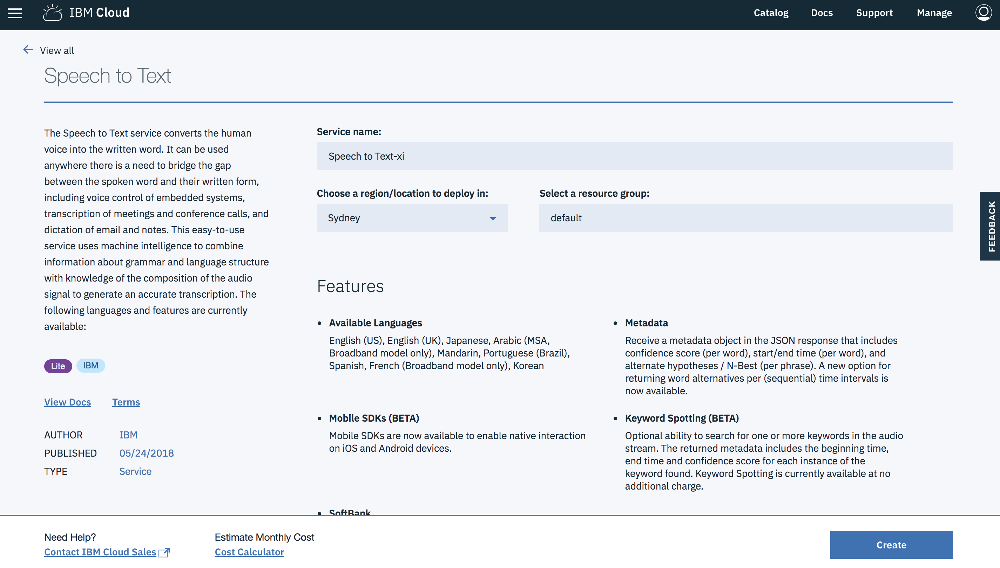

# Watson Speech To Text

### Open IBM Cloud Service Catalog:

Open the service from the catalog, name it and just create it.

> [Watson Speech To Text service catalog](https://console.bluemix.net/catalog/services/speech-to-text)

After the service is created, make sure you connect it to the main Node-RED Starter app: `IBM Cloud` -> `Connections` -> `Create connection` and choose the above just created service.
